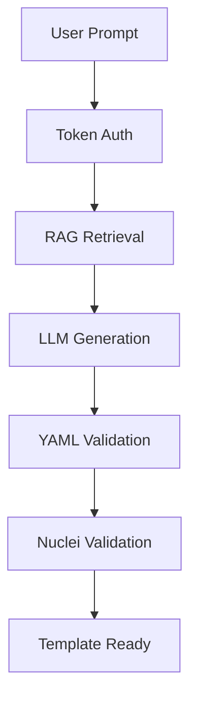

# 🤖 OASM Nuclei AI Template Generator


## 📖 Overview

**OASM Nuclei Generator** is an intelligent AI-powered system that automatically generates high-quality Nuclei security templates using **Large Language Models (LLM)** combined with **Retrieval-Augmented Generation (RAG)**.

🎯 **Purpose**: Transform natural language vulnerability descriptions into production-ready Nuclei YAML templates with automatic validation and refinement.

### ✨ Key Features

- 🧠 **AI-Powered Generation** - Generate templates using Gemini 2.0 or OpenAI GPT models
- 🔍 **RAG Knowledge Base** - Search 7000+ existing Nuclei templates for context
- ✅ **Auto-Validation** - Built-in YAML syntax + Nuclei validation
- 🚀 **RESTful API** - Production-ready FastAPI with OpenAPI docs
- 🐳 **Docker Ready** - One-command deployment with docker-compose
- 🔐 **Token Authentication** - Secure API access with token-based auth
- 📊 **Comprehensive Logging** - Full request/response monitoring

## ⚡ Quick Start

### Requirements

- Docker & Docker Compose
- API Key (Gemini/OpenAI) - optional for local embeddings

### Installation

```bash
# 1. Clone repository
git clone https://github.com/oasm-platform/oasm-nuclei-gen.git
cd oasm-nuclei-gen

# 2. Configure environment
cp .env.example .env
# Edit .env with your API keys

# 3. Start all services
docker-compose up -d

# 4. Test the API
curl http://localhost:8000/health
```

### Generate Your First Template

```bash
curl -X POST http://localhost:8000/api/v1/generate_template \
  -H "Content-Type: application/json" \
  -H "token: your-auth-token" \
  -d '{
    "prompt": "Create a Nuclei template to detect SQL injection in login form"
  }'
```

## 🔧 Services

| Service      | URL                        | Description                   |
| ------------ | -------------------------- | ----------------------------- |
| **API**      | http://localhost:8000      | Main FastAPI server           |
| **API Docs** | http://localhost:8000/docs | Interactive API documentation |
| **ChromaDB** | http://localhost:8001      | Vector database for RAG       |

## 🧠 System Architecture



**Core Components:**

- **API Service**: FastAPI with token authentication
- **AI Engine**: Gemini 2.0 / GPT-4 for template generation
- **Vector DB**: ChromaDB with 7000+ template embeddings
- **Validator**: Built-in YAML + Nuclei validation
- **Scheduler**: Automatic template database updates

## 📚 Documentation

- **🚀 [Developer Guide](DEVELOPER_GUIDE.md)** - Detailed setup, development, and API usage
- **📋 [API Documentation](http://localhost:8000/docs)** - Interactive Swagger UI (after setup)

## 🛡️ Security

This tool is designed for **authorized security testing only**. Features include:

- 🔐 Token-based API authentication
- 🏛️ Containerized deployment with security best practices
- 📝 Comprehensive audit logging
- 🚫 No credential storage in codebase

## 🤝 Contributing

1. Fork the repository
2. Create feature branch: `git checkout -b feature/amazing-feature`
3. Follow development guidelines in [DEVELOPER_GUIDE.md](DEVELOPER_GUIDE.md)
4. Submit a pull request

## 📄 License

This project is licensed under the **MIT License** - see the [LICENSE](LICENSE.md) file for details.

---

<div align="center">

### 🌟 **Star this project if it helps your security research!** 🌟

**Created with ❤️ for the cybersecurity community**

</div>
