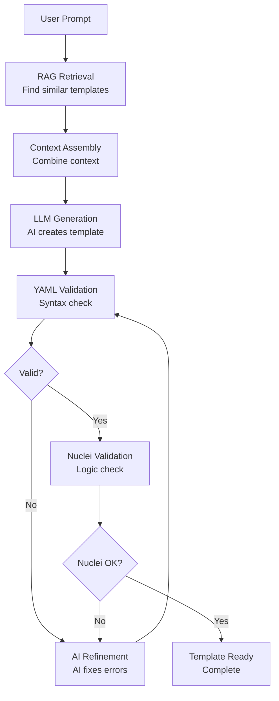

# 🤖 OASM Nuclei AI Template Generator


## 📖 Overview

**OASM Nuclei Generator** is an intelligent AI-powered system that automatically generates high-quality Nuclei security templates using advanced **Large Language Models (LLM)** combined with **Retrieval-Augmented Generation (RAG)**.

🎯 **Purpose**: Transform natural language vulnerability descriptions into production-ready Nuclei YAML templates with automatic validation and refinement.

🔬 **Technology Stack**: FastAPI + ChromaDB + Gemini/OpenAI + Docker with microservices architecture.

### ✨ Key Features

| Feature                      | Description                                              |
| ---------------------------- | -------------------------------------------------------- |
| 🧠 **AI-Powered Generation** | Generate templates using Gemini 2.0 or OpenAI GPT models |
| 🔍 **RAG Knowledge Base**    | Search 7000+ existing Nuclei templates for context       |
| ✅ **Auto-Validation**       | Built-in YAML syntax + Nuclei validation                 |
| 🚀 **RESTful API**           | Production-ready FastAPI with OpenAPI docs               |
| 🐳 **Docker Ready**          | One-command deployment with docker-compose               |
| 🔄 **Template Refinement**   | AI automatically fixes validation errors                 |
| 📊 **Debug Logging**         | Comprehensive logging for troubleshooting                |
| ⏰ **Auto Scheduler**        | Daily automatic RAG data updates                         |

## 📁 Project Structure

```
oasm-nuclei-gen/
├── 🐳 docker-compose.yml          # Microservices orchestration (api, chromadb, scheduler)
├── 📋 Dockerfile                  # Container build for all services
├── ⚙️ .env                        # Environment configuration
├── 📄 requirements.txt            # Python dependencies
│
├── 🚀 app/                        # Core application
│   ├── main.py                    # FastAPI entry point
│   ├── core/                      # Business logic
│   │   ├── nuclei_service.py      # LLM + RAG orchestration
│   │   ├── rag_engine.py          # ChromaDB integration
│   │   ├── nuclei_runner.py       # Template validation
│   │   └── scheduler.py           # Standalone scheduler service
│   ├── api/v1/                    # REST API endpoints
│   │   ├── endpoints.py           # Route handlers
│   │   └── v1_dto.py             # Request/Response models
│   └── services/                  # External integrations
│       └── vector_db.py           # Database abstraction
│
├── 🧠 templates/                  # AI prompt engineering
│   └── nuclei_prompts/
│       ├── system_prompt.txt      # LLM system context
│       └── user_prompt_template.txt # Generation instructions
│
├── 📚 rag_data/                   # Knowledge base
│   └── nuclei_templates/          # 7000+ template collection from nuclei-templates repo
│       ├── http/cves/             # CVE templates
│       ├── http/vulnerabilities/  # Vulnerability templates
│       ├── file/keys/             # Secret detection templates
│       └── workflows/             # Multi-step scan workflows
│
└── 📊 logs/                       # Application monitoring
    ├── app.log                   # API service logs
    └── scheduler.log             # Scheduler service logs
```

## ⚡ Installation & Setup Guide

### 🎯 System Requirements

| Requirement    | Version       | Required   |
| -------------- | ------------- | ---------- |
| Docker         | 20.10+        | ✅         |
| Docker Compose | v2.0+         | ✅         |
| RAM            | 2GB+          | ✅         |
| API Key        | Gemini/OpenAI | Optional\* |

\*_Uses free local embeddings by default_

### 🚀 Quick Installation (Docker - Recommended)

```bash
# 1. Clone repository
git clone https://github.com/oasm-platform/oasm-nuclei-gen.git
cd oasm-nuclei-gen

# 2. Copy and configure environment
cp .env.example .env
# Edit .env file with your API keys:
# GEMINI_API_KEY=your_gemini_key_here
# OPENAI_API_KEY=your_openai_key_here

# 3. Start all services (ChromaDB, API, Scheduler)
docker-compose up -d

# 4. Check deployment status
curl http://localhost:8000/health
```

### 🎯 Test Your First Template Generation

```bash
curl -X POST http://localhost:8000/api/v1/generate_template \
  -H "Content-Type: application/json" \
  -d '{
    "prompt": "Create a Nuclei template to detect SQL injection in login form. Test username parameter with POST method. Severity: high"
  }'
```

### 🔧 Running Services

| Service       | URL                        | Description                               |
| ------------- | -------------------------- | ----------------------------------------- |
| **API**       | http://localhost:8000      | Main FastAPI server                       |
| **API Docs**  | http://localhost:8000/docs | Swagger UI documentation                  |
| **ChromaDB**  | http://localhost:8001      | Vector database for RAG                   |
| **Scheduler** | N/A (background)           | Auto-update RAG data (background service) |

---

## 🔧 Manual Installation (Without Docker)

### Step 1: Clone Repository

```bash
git clone https://github.com/oasm-platform/oasm-nuclei-gen.git
cd oasm-nuclei-gen
```

### Step 2: Create Python Virtual Environment

```bash
python3 -m venv venv
source venv/bin/activate  # Linux/Mac
# or
venv\Scripts\activate     # Windows
```

### Step 3: Install Dependencies

```bash
pip install -r requirements.txt
```

### Step 4: Configure Environment

```bash
cp .env.example .env
# Edit .env with appropriate configuration
```

### Step 5: Start ChromaDB (Requires Docker)

```bash
docker run -d --name nuclei_chromadb -p 8001:8000 chromadb/chroma:latest
```

### Step 6: Initialize RAG Data

```bash
# Download nuclei templates
git clone https://github.com/projectdiscovery/nuclei-templates.git rag_data/nuclei_templates

# Or use API endpoint after running the app
# curl -X PUT "http://localhost:8000/api/v1/reload_template" \
#   -H "Content-Type: application/json" \
#   -d '{"force_update": true}'
```

### Step 7: Run Services

```bash
# Terminal 1: Run API server
python -m app.main

# Terminal 2: Run scheduler (if auto-update needed)
python -m app.core.scheduler
```

## 🎮 API Usage

### 🌐 Interactive API Documentation

Access automatically generated API documentation:

- **Swagger UI**: http://localhost:8000/docs
- **ReDoc**: http://localhost:8000/redoc
- **Health Check**: http://localhost:8000/health

## 🧠 System Architecture

### 🔄 AI Processing Flow



### 🏗️ Microservices Architecture

| Component       | Technology         | Purpose                             |
| --------------- | ------------------ | ----------------------------------- |
| **API Service** | FastAPI + Uvicorn  | REST endpoints, async processing    |
| **AI Engine**   | Gemini 2.0 / GPT-4 | Template generation & improvement   |
| **Vector DB**   | ChromaDB           | Semantic search of 7000+ templates  |
| **Validator**   | Nuclei CLI         | YAML validation + security rules    |
| **Scheduler**   | APScheduler        | Automatic template database updates |
| **Storage**     | Docker Volumes     | Logs & data persistence             |

### 🔍 RAG Knowledge Base

- **7000+ Templates**: CVEs, vulnerabilities, exposures from ProjectDiscovery
- **Semantic Search**: Find similar templates based on user intent
- **Context-Aware**: Provides similar patterns for AI learning
- **Auto-Updated**: Scheduler automatically pulls new templates daily

## 🔧 Advanced Configuration

### 🔑 Important Environment Variables

| Variable                      | Default                | Description                         |
| ----------------------------- | ---------------------- | ----------------------------------- |
| `LLM_PROVIDER`                | `gemini`               | AI provider: `gemini` or `openai`   |
| `LLM_MODEL`                   | `gemini-2.0-flash-exp` | AI model name                       |
| `AUTO_UPDATE_TEMPLATE_NUCLEI` | `true`                 | Enable/disable auto-update RAG data |
| `TIME_UPDATE_TEMPLATE`        | `19:19`                | Update schedule time (HH:MM)        |
| `VECTOR_DB_HOST`              | `chromadb`             | ChromaDB connection host            |
| `RAG_MAX_RETRIEVED_DOCS`      | `5`                    | Number of template contexts to use  |

### 🎛️ LLM Provider Configuration

**Gemini (Recommended)**:

```bash
LLM_PROVIDER=gemini
LLM_MODEL=gemini-2.0-flash-exp
GEMINI_API_KEY=your_gemini_key_here
```

**OpenAI**:

```bash
LLM_PROVIDER=openai
LLM_MODEL=gpt-4o
OPENAI_API_KEY=your_openai_key_here
```

### 🏗️ Production Deployment

**Production environment with full validation**:

```bash
# Update .env
TEMPLATE_VALIDATION_REQUIRED=true
LOG_LEVEL=INFO
AUTO_UPDATE_TEMPLATE_NUCLEI=true
TIME_UPDATE_TEMPLATE=02:00

# Deploy with scaling
docker-compose up -d
```

### ⏰ Auto-Update Scheduler Configuration

```bash
# Enable daily auto-update
AUTO_UPDATE_TEMPLATE_NUCLEI=true
TIME_UPDATE_TEMPLATE=02:00  # Run at 2 AM daily

# Disable auto-update
AUTO_UPDATE_TEMPLATE_NUCLEI=false
```

## 🧪 Testing & Debugging

### 🔍 System Health Checks

```bash
# Check health of all services
curl http://localhost:8000/health

# Check ChromaDB
curl http://localhost:8001/api/v2/heartbeat

# Test template generation
curl -X POST http://localhost:8000/api/v1/generate_template \
  -H "Content-Type: application/json" \
  -d '{"prompt": "Test XSS template for input field"}'

# View logs
docker-compose logs api
docker-compose logs scheduler
docker-compose logs chromadb
```

### 📊 Monitoring

```bash
# View container status
docker-compose ps

# Monitor logs in real-time
docker-compose logs -f api
```

## 🛡️ Security & Compliance

⚠️ **Legal Notice**: This tool is designed for **authorized security testing only**. Users must comply with applicable laws and only test systems they own or have explicit permission to test.

### 🔒 Security Best Practices

- 🔐 Store API keys only in environment variables
- 🚫 Never commit credentials to git
- 🏛️ Containerized deployment with non-root users
- 📝 Comprehensive audit logging
- 🔄 Regular dependency updates

### 🚨 Troubleshooting

#### Common Issues:

1. **ChromaDB connection failed**:

   ```bash
   # Check ChromaDB is running
   docker ps | grep chromadb

   # Restart ChromaDB
   docker-compose restart chromadb
   ```

2. **API key not working**:

   ```bash
   # Check .env file
   cat .env | grep API_KEY

   # Restart API service
   docker-compose restart api
   ```

3. **RAG data empty**:
   ```bash
   # Force update RAG data
   curl -X PUT http://localhost:8000/api/v1/reload_template \
     -H "Content-Type: application/json" \
     -d '{"force_update": true}'
   ```

## 🤝 Contributing

We welcome contributions! Please follow these guidelines:

1. 🍴 Fork the repository
2. 🌟 Create a feature branch: `git checkout -b feature/amazing-feature`
3. 📝 Update documentation if needed
4. 🚀 Submit a pull request

## 🏆 Acknowledgments

| Project                                                | Purpose                  | License    |
| ------------------------------------------------------ | ------------------------ | ---------- |
| [Nuclei](https://github.com/projectdiscovery/nuclei)   | Security scanner engine  | MIT        |
| [ChromaDB](https://github.com/chroma-core/chroma)      | Vector database          | Apache 2.0 |
| [FastAPI](https://github.com/tiangolo/fastapi)         | Modern API framework     | MIT        |
| [LangChain](https://github.com/langchain-ai/langchain) | AI application framework | MIT        |

## 📄 License

This project is licensed under the **MIT License** - see the [LICENSE](LICENSE) file for details.

---

<div align="center">

### 🌟 **If this project is useful for your security research, please star it on GitHub!** 🌟

**Created with ❤️ for the cybersecurity community by the OASM team**

[](https://github.com/oasm-platform/oasm-nuclei-gen.git)

</div>
